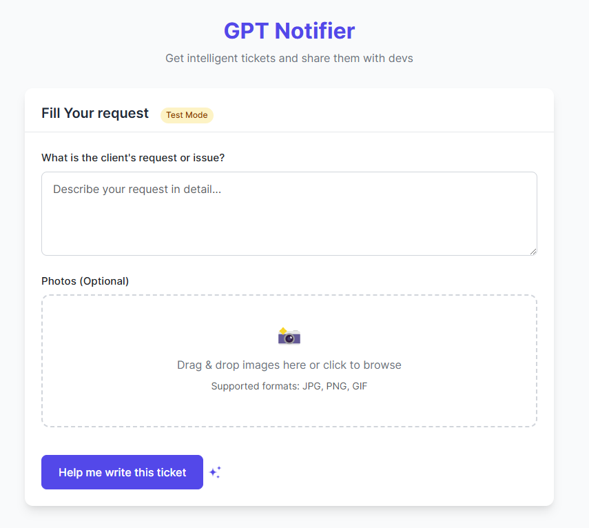

# Bubble Ticket Generator 🎫  

Automatically generate structured tickets for Bubble.io developers based on client requests and uploaded images.  

## 📸 App Preview  
  

## 🚀 Features  
- ✅ AI-powered ticket generation based on client request.  
- ✅ Structured output with Title, Context, Description, and Acceptance Criteria.  
- ✅ Supports feature requests and bug reports.  
- ✅ Image analysis for better context understanding.  

## 🎯 How It Works  
1. Enter the client’s request in the input field.  
2. Upload any relevant images (screenshots, mockups, etc.).  
3. Click **"Help me write this ticket"** to trigger the AI.  
4. Review and refine the structured ticket before submission.  
5. Send the final ticket to dev or P.M by slack

## 🔧 Tech Stack  
- **OpenAI API** for natural language processing.  
- **Slack** for sending the final ticket